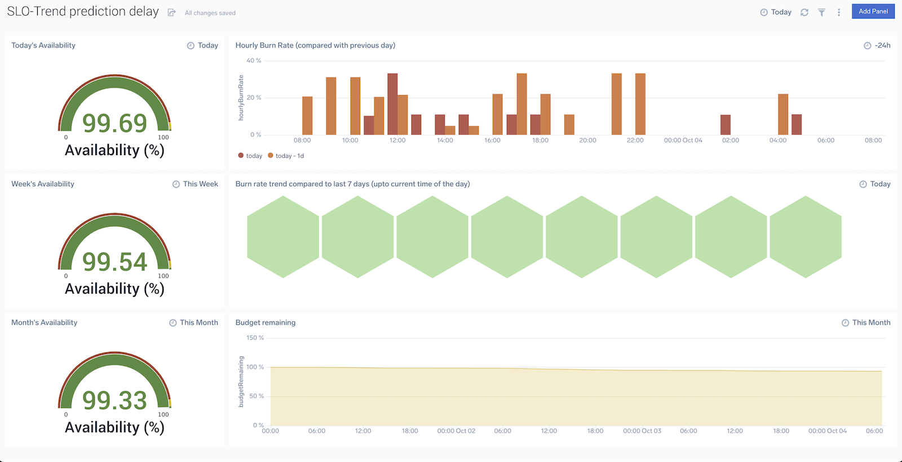
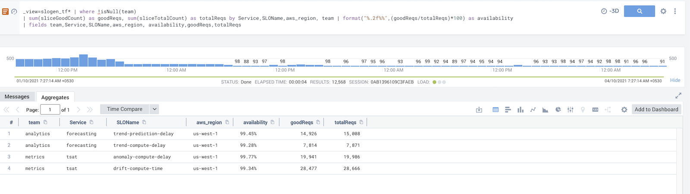
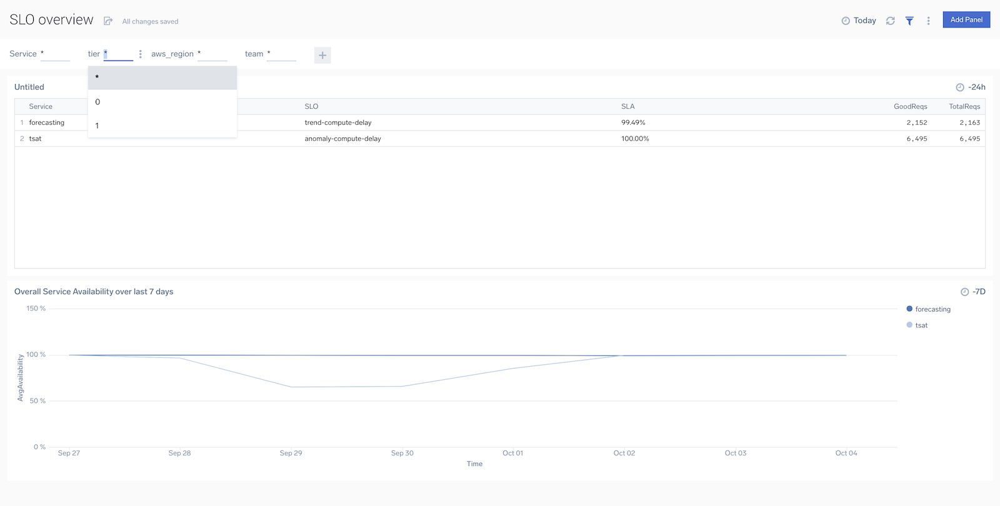
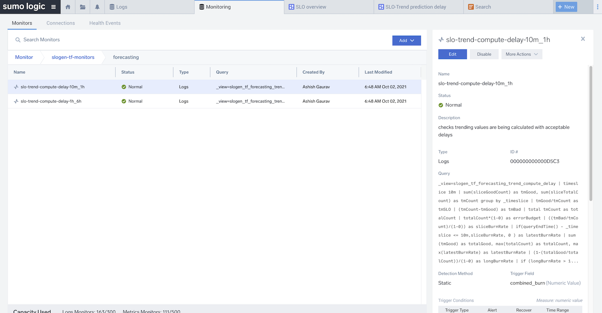

### slogen

CLI tool to generate SLO dashboards, monitors & scheduled views
from [OpenSLO](https://github.com/OpenSLO/OpenSLO#specification) configs. Currently only supports sumo as data source
and target.

For a given config it will create the following content via sumo terraform provider

- [Scheduled view](https://help.sumologic.com/Manage/Scheduled-Views) to generate the aggregated SLI data
- [Dashboards](https://help.sumologic.com/Visualizations-and-Alerts/Dashboard_(New)) to track availability, burn rate
  and budget remaining
- [monitors](https://help.sumologic.com/Visualizations-and-Alerts/Alerts/Monitors) :  [Multi-Window, Multi-BurnRate](https://sre.google/workbook/alerting-on-slos/)
- Global dashboard, to track availability across all services in a single view
- The content are grouped into folders of the service they belong to
- slice & dice SLI data in view to create custom reports by metadata (e.g. availability by customers, region)






#### sample config

```yaml
apiVersion: openslo/v1alpha
kind: SLO
metadata:
  displayName: SLO descriptive name
  name: slo-minimal-name   # only '-' is allowed apart from alphanumeric chars, '-' not allowed in start or end
spec:
  service: my-service
  description: slo description to be added in dashboard text panel
  budgetingMethod: Occurrences
  objectives:
    - ratioMetrics:
        total: # sumo query to filter out all the messages counting requests for this slo
          source: sumologic
          queryType: Logs
          query: '_sourceCategory=my-service | where api_path="/login"'
        good: # condition to filter out healthy request/events
          source: sumologic
          queryType: Logs
          query: '(responseTime) < 500 and (statusCode matches /[2-3][0-9]{2}/ )'
        incremental: true
      displayName: delay less than 350
      target: 0.98
fields: # fields from log to retain
  region: "aws_region"    # log field as it is
  deployment: 'if(isNull(deployment),"dev",deployment)' # using an expression
labels:
  tier: 0                 # static labels to include in SLI view, that are not present in the log messages
alerts:
  burnRate: # Multiwindow, Multi-Burn-Rate Alerts, explained here https://sre.google/workbook/alerting-on-slos/ 
    - shortWindow: '10m' # the smaller window
      shortLimit: 14  # limit for the burn rate ratio, 14 denotes the error consumed in the window were 14 times the allowed number  
      longWindow: '1h'
      longLimit: 14
      notifications: # one or more notification channels
        - connetionType: 'Email'
          recipients: 'youremailid@email.com'
          triggerFor:
            - Warning
            - ResolvedWarning
        - connetionType: 'PagerDuty'
          connectionID: '1234abcd'  # id of pagerduty connection created in sumo
          triggerFor:
            - Critical
            - ResolvedCritical


```

#### Getting the tool

##### install with go1.17 as `go install github.com/SumoLogic-Incubator/slogen@latest`

latest golang release can be installed by using the directions here : https://github.com/udhos/update-golang#usage.
Add `$GOPATH/bin` to your `$PATH`.

It can be done with

```
export PATH=`go env GOPATH`/bin:$PATH
```

##### Get the latest binary from [release page](https://github.com/SumoLogic-Incubator/slogen/releases) and put it in a directory in your `$PATH` (e.g. `$HOME/.local/bin` )

###### For Linux

``` shell
wget -O - https://github.com/SumoLogic-Incubator/slogen/releases/download/v0.6.1/slogen_0.6.1_Linux_x86_64.tar.gz | tar xvz -C /path/to/bin
```

###### For Mac

``` shell
wget -O - https://github.com/SumoLogic-Incubator/slogen/releases/download/v0.6.1/slogen_0.6.1_Darwin_x86_64.tar.gz | tar xvz -C /path/to/bin
```

### Using the tool

###### Set the sumologic auth as `ENV` variables as required by the [terraform provider](https://registry.terraform.io/providers/SumoLogic/sumologic/latest/docs#environment-variables):

--- 

###### create the yaml config for the SLO. more [samples](samples/openslo) based on real data.

--- 

###### validate the configs as (you can also pass the path to the entire dir to validate the files in it.)

`slogen validate path/to/config`

--- 

###### run the tool to generate the terraform files and apply them (you can remove the `--apply` to just generate the files)

`slogen path/to/config --apply`


--- 

###### for further details run `slogen help`

```
Usage:
slogen [paths to yaml config]... [flags]
slogen [command]

Examples:
slogen service/search.yaml 
slogen ~/team-a/slo/ ~/team-b/slo ~/core/slo/login.yaml 
slogen ~/team-a/slo/ -o team-a/tf
slogen ~/team-a/slo/ -o team-a/tf --apply 

Available sub-commands:
help          Help about any command 
new           create a sample config from given profile 
validate      config is as per OpesSLO standards and has valid values.
completion    generate the autocompletion script for the specified shell 
docs          A brief description of your command 

Flags:
-o, --out string        :   output directory where to create the terraform files (default "tf")
-d, --dashboardFolder   :   string output directory where to create the terraform files (default "slogen-tf-dashboards")
-m, --monitorFolder     :   string output directory where to create the terraform files (default "slogen-tf-monitors")
-i, --ignoreErrors      :   whether to continue validation even after encountering errors 
-p, --plan              :   show plan output after generating the terraform config 
-a, --apply             :   apply the generated terraform config as well 
-c, --clean             :   clean the old tf files for which openslo config were not found in the path args 
-h, --help              :   help for slogen


Use "slogen [command] --help" for more information about a command. Example config with inline comment explaining the
various fields

```

#### Where are the content created

- Dashboards by default are created in a folder `slogen-tf-dashboards`. A different folder can be set with the
  flag `-d or --dashboardFolder` followed by name of the folder. It will take some time for historical data to be
  calculated for new views for dashboards to be accurate.
- Monitors by default are created in a folder `slogen-tf-monitors`. A different folder can be set with the
  flag `-m or --monitorFolder` followed by name of the folder.
- Scheduled view are created with a prefix `slogen_tf_`, this can't be changed as of now.
- `SLO Overview` dashboard is created at the root of Dashboard folder specified.

#### Limitations

- as of now only supports Sumologic Logs as data source and content target.
- Only `Occurrences` based `budgetingMethod` is handled. support for `Timeslices` is work in progress.
- Alerting on SLO, burn-rate can be configured only up-to `24h`. Tracking them via dashboard is still possible for up-to
  31 days.

#### deleting resources created

run the below command

`slogen destroy [path ot out dir (default to './tf')]`

It will show the resources that deleted and ask for confirmation before deleting them. 
