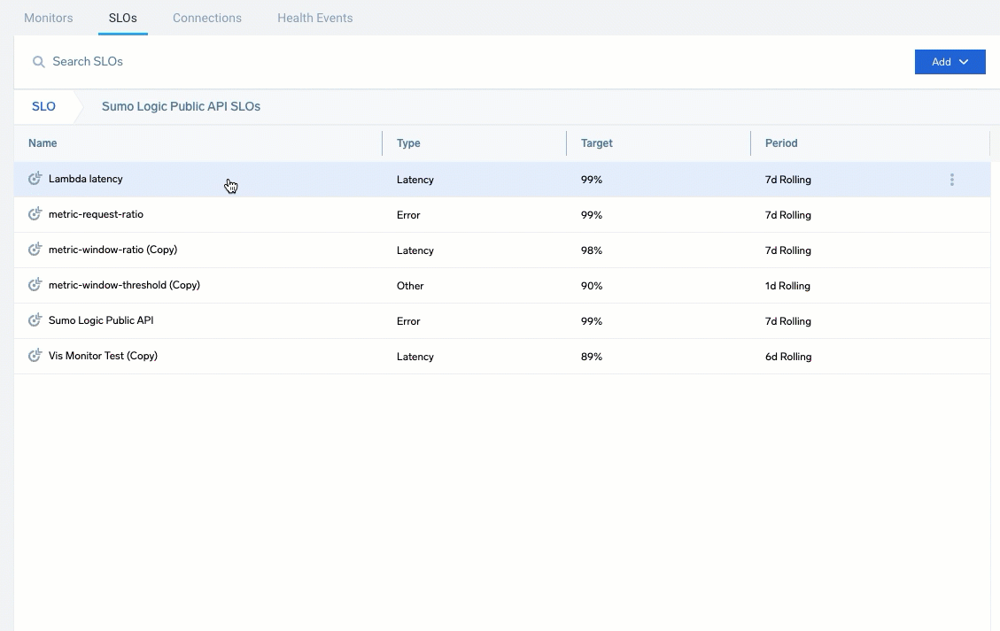
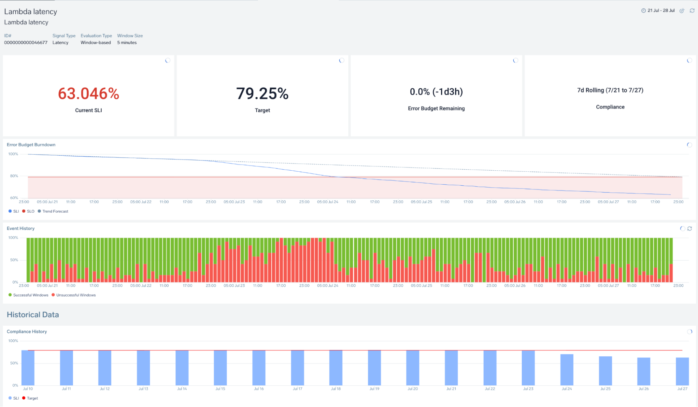
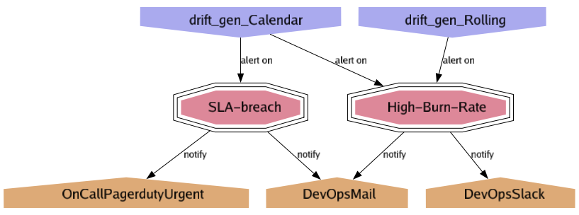

### slogen

CLI tool to generate SLO dashboards, monitors & SLI data
from [OpenSLO](https://github.com/OpenSLO/OpenSLO#specification) configs. 
The resources are generated via terraform which can be consumed on its as as well.


Currently supported vendors/data sources.

- Sumologic - more details [here](samples/sumologic/README.md) 




A flow graph of `SLO` to `AlertPolicy` to `AlertNotificationTarget` is also generated in the output dir as `slo-dep-graph.png`.
Flow graphs for sample configs [here](samples/sumologic/v1) (only supported for v1 onward specs).




#### Getting the tool

##### install with go1.17 or above as `go install github.com/OpenSLO/slogen@v1.0.1`

latest golang release can be installed by using the directions here : https://github.com/udhos/update-golang#usage.
Add `$GOPATH/bin` to your `$PATH`.

It can be done with

```
export PATH=`go env GOPATH`/bin:$PATH
```

The pre-compiled binaries for specific platforms are also available on the [release](https://github.com/OpenSLO/slogen/releases) page.

### Using the tool

##### Set the sumologic auth as `ENV` variables as required by the [terraform provider](https://registry.terraform.io/providers/SumoLogic/sumologic/latest/docs#environment-variables):

##### _Note_ : Terraform installation is not required as the tool binary has it embedded as [terraform-exec](https://github.com/hashicorp/terraform-exec)

--- 

##### create the yaml config for the SLO. more [samples](samples/sumologic/logs) based on real data.

--- 

##### validate the configs as (you can also pass the path to the entire dir to validate the files in it.)

`slogen validate path/to/config`

--- 

##### run the tool to generate the terraform files and apply them (you can remove the `--apply` to just generate the files)

`slogen path/to/config --apply`

If you remove any of the OpenSLO configs, then you should use

`slogen path/to/config --apply --clean`

the `--clean` option will remove the generated terraform files for which the yaml config no longer exists.

--- 

##### running the tool behind a http/https proxy
set the following env variables in the bash session before running the tool

```shell
export HTTP_PROXY="http://proxyIp:proxyPort"
export HTTPS_PROXY="http://proxyIp:proxyPort"
```

##### for further details run `slogen help`

```
Usage:
slogen [paths to yaml config]... [flags]
slogen [command]

Examples:
slogen service/search.yaml 
slogen ~/team-a/slo/ ~/team-b/slo ~/core/slo/login.yaml 
slogen ~/team-a/slo/ -o team-a/tf
slogen ~/team-a/slo/ -o team-a/tf --apply --clean 

Available sub-commands:
help          Help about any command 
list          utility command to get additional info about your sumo resources e.g.
destroy       destroy the content generated from the slogen command, equivalent to 'terraform destroy'
new           create a sample config from given profile 
validate      config is as per OpesSLO standards and has valid values.
completion    generate the autocompletion script for the specified shell 
docs          A brief description of your command 

Flags:
-o, --out string        :   output directory where to create the terraform files (default "tf")
-d, --dashboardFolder   :   string output directory where to create the terraform files (default "slogen-tf-dashboards")
-m, --monitorFolder     :   string output directory where to create the terraform files (default "slogen-tf-monitors")
-i, --ignoreErrors      :   whether to continue validation even after encountering errors 
-p, --plan              :   show plan output after generating the terraform config 
-a, --apply             :   apply the generated terraform config as well 
-c, --clean             :   clean the old tf files for which openslo config were not found in the path args 
-h, --help              :   help for slogen
    --asModule          :   whether to generate the terraform config as a module
    --useViewHash      :   whether to use descriptive or hashed name for the scheduled views, hashed names ensure data for old view is not used when the query for it changes

Use "slogen [command] --help" for more information about a command. Example config with inline comment explaining the
various fields

```

### deleting resources created

run the below command

`slogen destroy [path to out dir (default to './tf')]`

It will show the resources that will be deleted and ask for confirmation before deleting them. 


### sample configs
- [`openslo/v1`](samples/sumologic/v1)
- deprecated [`openslo/v1alpha`](samples/sumologic/logs)


##### Getting connection ID's for alert notification
Currently, the sumo UI doesn't provide a way to get the connection id's for alert notification.
As a workaround, you can use the following command to get the id list.

```shell
slogen list -c
```

### Change Log
- [New feature and fixes in v1.0](CHANGELOG.md)

